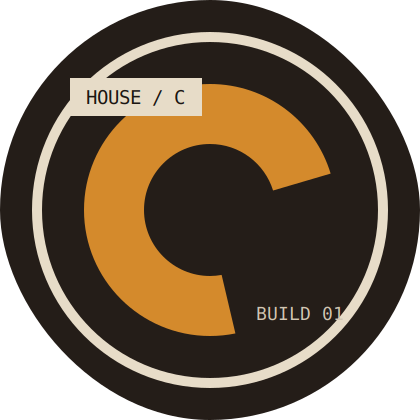
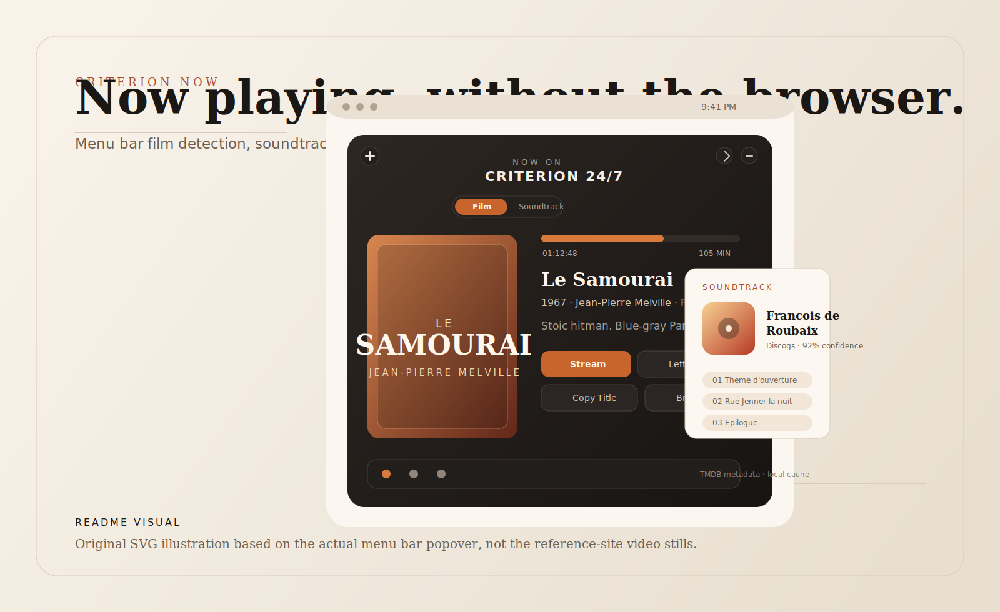
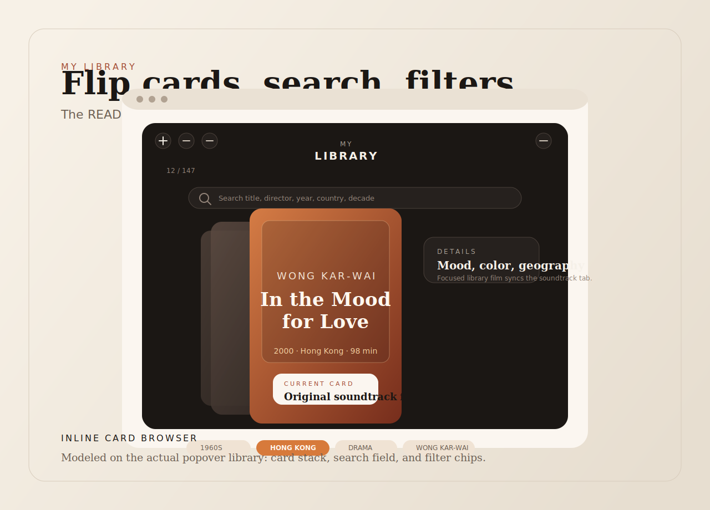
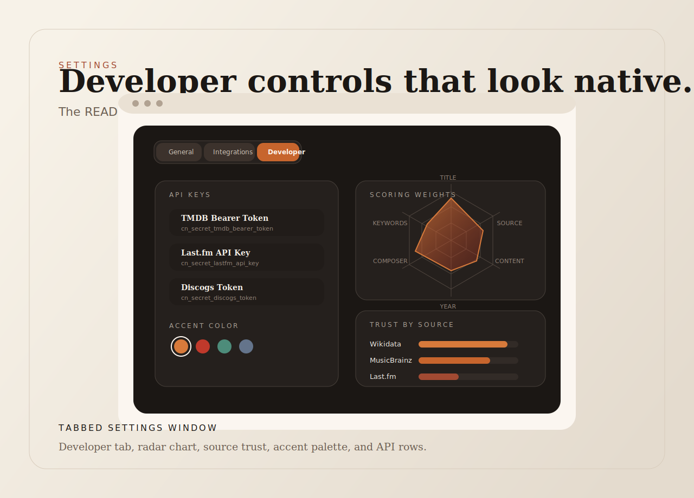

# Criterion Now

<div align="center">
  
  <p><strong>A cinematic macOS menu bar companion for the Criterion Channel 24/7 stream.</strong></p>
  <p>
    
    
    
    
  </p>
  <p>
    <a href="https://jeanluciradukunda.github.io/criterion-now/">Live Site</a>
    ·
    <a href="https://github.com/jeanluciradukunda/criterion-now/releases/latest">Latest Release</a>
    ·
    <a href="https://github.com/jeanluciradukunda/criterion-now">Source</a>
  </p>
</div>

Criterion Now turns the Criterion Channel into something that feels closer to a living repertory cinema than a browser tab. It sits in the menu bar, tells you exactly what is playing on the 24/7 stream, opens the stream in a floating mini player, surfaces soundtrack matches from multiple music sources, mirrors your Criterion `My List`, and keeps a running viewing history while the app is open.

<p align="center">
  
</p>

## Why It Feels Different

| Live Stream Companion | Soundtrack Intelligence | Library That Feels Editorial |
| --- | --- | --- |
| Detects the current film from Criterion's 24/7 stream, shows rich metadata, and keeps a real-time progress bar moving in the menu bar popover. | Searches Wikidata, MusicBrainz, Discogs, iTunes, and Last.fm in parallel, then ranks results with a weighted scoring model. | Pulls `My List` and collections into a local-first browser with flip cards, search, filters, and a full-window poster layout. |

| History That Builds Itself | Geography + Stats | Built Like a Native Mac App |
| --- | --- | --- |
| Logs every detected film change and renders a clean timeline grouped by day. | Maps your library by country on a 3D globe and breaks it down by directors, decades, and totals. | SwiftUI + AppKit, `MenuBarExtra`, a shared `WKWebView` session for streaming and scraping, and local JSON persistence for fast reloads. |

## Interface Gallery

<table>
  <tr>
    <td width="33%">
      
      <p><strong>Now Playing + Soundtrack</strong><br />Original SVG artwork based on the actual popover, progress bar, actions, and soundtrack flow.</p>
    </td>
    <td width="33%">
      
      <p><strong>Library Flip Cards</strong><br />Inline card browser with search, filters, and a focused film that drives the soundtrack context.</p>
    </td>
    <td width="33%">
      
      <p><strong>Developer Controls</strong><br />Tabbed settings, API keys, accent palette, and the soundtrack scoring radar.</p>
    </td>
  </tr>
</table>

## Highlights

- Menu bar app with a native `MenuBarExtra` window, floating mini player, and launch-at-login support.
- Real-time now-playing metadata, notifications when the next film starts, and automatic progress estimation.
- Parallel soundtrack lookup with source attribution, confidence scoring, track lists, and deep links to music services.
- Criterion `My List` scraping through the shared web session, plus local caching so the library feels instant after first load.
- Searchable library views with title, director, year, country, and decade matching.
- Viewing history, country-based globe visualization, and stats for films, countries, directors, and year span.
- Included marketing site in [`site/`](site) built with SolidJS and Vite.

## Getting Started

### App Prerequisites

- macOS 14 or newer
- Xcode 16 or newer
- A Criterion Channel account for stream access and `My List`
- TMDB, Last.fm, and Discogs credentials if you want full metadata and soundtrack features

### Run The macOS App

1. Clone the repository.
2. Create your local secrets file:

```bash
cp CriterionNow/Resources/Secrets.example.plist CriterionNow/Resources/Secrets.plist
```

3. Fill in the keys inside your local `CriterionNow/Resources/Secrets.plist`.
4. Open `CriterionNow.xcodeproj` in Xcode.
5. Build and run the `CriterionNow` target.
6. Start the stream once so the shared `WKWebView` session is authenticated, then refresh `My List` inside the app.

`Secrets.plist` is ignored by git. The example file lives at [`CriterionNow/Resources/Secrets.example.plist`](CriterionNow/Resources/Secrets.example.plist).

### Regenerate The Xcode Project

The repo includes a committed Xcode project, so this step is optional. If you prefer to regenerate it from the spec in [`project.yml`](project.yml):

```bash
xcodegen generate
```

## Companion Site

The landing page is a separate SolidJS app under [`site/`](site). The published URL is [https://jeanluciradukunda.github.io/criterion-now/](https://jeanluciradukunda.github.io/criterion-now/).

```bash
cd site
pnpm install
pnpm dev
```

For a production build:

```bash
cd site
pnpm build
```

The Vite base path is configured for GitHub Pages in [`site/vite.config.ts`](site/vite.config.ts), which is why the repo only needed the deployment path `/criterion-now/` until now.

## Project Structure

| Path | Purpose |
| --- | --- |
| [`CriterionNow/`](CriterionNow) | Main macOS app: app entry, models, services, views, resources |
| [`CriterionNowWidget/`](CriterionNowWidget) | Widget extension and shared now-playing data |
| [`site/`](site) | Marketing site built with SolidJS and Vite |
| [`project.yml`](project.yml) | XcodeGen project definition |
| [`TODO.md`](TODO.md) | Product backlog, shipped work, and architecture notes |

## Data Sources

Criterion Now combines data from Criterion, TMDB, MusicBrainz, Wikidata, Discogs, iTunes, and Last.fm. The app scrapes the Criterion session through `WKWebView`, enriches titles with TMDB, and caches library/history data locally to keep the interface responsive.

## License

Released under the MIT License. See [`LICENSE`](LICENSE).
